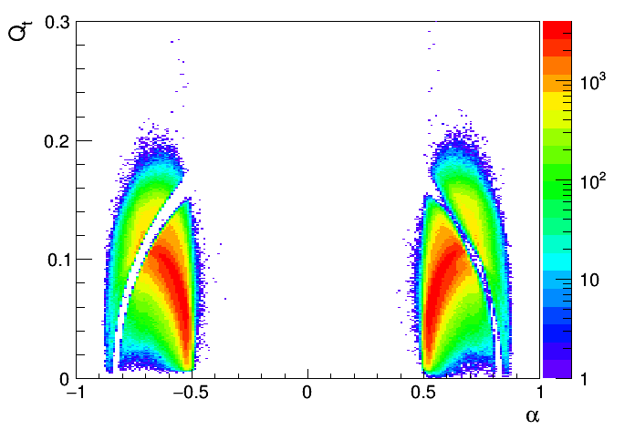

~~~c++
// pt                          0,   1,   2,   3,   4,   5,   6,   7,   8,   9,  10,  11,  12
    double pTbin[14] = {0.2, 0.4, 0.6, 0.8, 1.0, 1.4, 1.8, 2.2, 2.8, 3.6, 4.6, 6.0, 7.0, 8.5};
// cent                   0,  1,   2,   3,   4
    int centBin[6] = {0, 20, 60, 100, 160, 200};
~~~

## Samples

| | |
|---|---|
| Data (HIMB4 RERECO) | `/HIMinimumBias4/qwang-V0Skim_v3-9d53152409b8a9b6fb15042030d9bf69/USER` |
| MC (Semi-private RECODEBUG)  | `/MinBias_Hydjet_Drum5F_2018_5p02TeV/qwang-crab_HydjetDrum5F_RECODEBUG_V0Skim_v2-4fb2a1ba2f6b043399c08fb9db565e25/USER` |

## BDT

### Training strategy

* Signal and background are from MC.
* 250 DTs, Depth = 4, AdaptiveBoost. `H:!V:NTrees=250:MinNodeSize=2.5%:MaxDepth=3:BoostType=AdaBoost:AdaBoostBeta=0.5:UseBaggedBoost:BaggedSampleFraction=0.5:SeparationType=GiniIndex:nCuts=20`
* TMVA Classification [code](TMVAClassification_full.C)

~~~bash
root -l -b -q 'TMVAClassification_full.C("LM")'
root -l -b -q 'TMVAClassification_full.C("KS")'
~~~

### Training MC

| MC Description | Location |
|---|---|
| Hydjet $\Lambda$ signal | ```/eos/cms/store/group/phys_heavyions/qwang/PbPb2018/V0Performance/MC/HydjetMCTruth_LM.root```  |
| Hydjet $K_{S}$ signal   | ```/eos/cms/store/group/phys_heavyions/qwang/PbPb2018/V0Performance/MC/HydjetMCTruth_KS.root```  |
| Hydjet $\Lambda$ background | ```/eos/cms/store/group/phys_heavyions/qwang/PbPb2018/V0Performance/MC/HydjetMCBkg_LM.root```  |
| Hydjet $K_{S}$ background   | ```/eos/cms/store/group/phys_heavyions/qwang/PbPb2018/V0Performance/MC/HydjetMCBkg_KS.root```  |

### Variables

|Train Variable| description |
|---|---|
|cosThetaXYZ | Cosine 3D pointing angle $\theta$ |
| Cent | centrality bin |
| DCA | Distance of the closest approach |
| Lxyz | 3D decay length |
|pt       |  $p_T$ |
|rapidity |  $y$   |
| pTrkNHit | NHit of the positive daughter track |
| nTrkNHit | NHit of the negative daughter track |
|vtxChi2  | vertex Chi2 |
| pTrkPt | $p_T$ of the positive daughter track |
| nTrkPt | $p_T$ of the negative daughter track |
| pTrkEta | $\eta$ of the positive daughter track |
| nTrkEta | $\eta$ of the negative daughter track |
| pTrkDCASigXY | transverse DCA significance of the positive daughter track |
| nTrkDCASigXY | transverse DCA significance of the negative daughter track |
| pTrkDCASigZ  | longitudinal DCA significance of the positive daughter track |
| nTrkDCASigZ  | longitudinal DCA significance of the negative daughter track |
| vtxDecaySigXYZ | 3D vertex significance |
| pTrkPtError | $p_T$ error of the positive daughter track |
| pTrkNPxLayer | NPixel layer with hits of the positive daughter track |
| nTrkPtError | $p_T$ error of the negative daughter track |
| nTrkNPxLayer | NPixel layer with hits of the negative daughter track |

|Spectator Variable| description |
|---|---|
|mass | V0 particle mass |
|eta  | V0 particle $\eta$ |
|phi  | V0 particle $\phi$ |
|pdgId| V0 particle pdgId |


### BDT Optimization

* $K_{S}^0$ Significance as a function of BDT


* $\Lambda$ Significance as a function of BDT


* To be consistent, the final BDT cut is set at **0.15** for both $K_{S}^0$ and $\Lambda$.

### $K_{s}^0$ BDT Performance

### Centrality 0-10%


### Centrality 10-30%


### Centrality 30-50%


### Centrality 50-80%


### $\Lambda$ BDT Performance

### Centrality 0-10%


### Centrality 10-30%


### Centrality 30-50%


### Centrality 50-80%


## $\Lambda$ Efficiencies and fake rates

### $\Lambda$ acceptance


### $\Lambda$ RECO efficiency


### $\Lambda$ total efficiency


### $\Lambda$ fake rate


### $\Lambda$ 2D total efficiency

* 0-10%


* 10-30%


* 30-50%


* 50-80%


## $K_{S}^0$ Efficiencies and fake rates

### $K_{S}^0$ acceptance


### $K_{S}^0$ RECO efficiency


### $K_{S}^0$ total efficiency


### $K_{S}^0$ fake rate


### $K_{S}^0$ 2D total efficiency

* 0-10%


* 10-30%


* 30-50%


* 50-80%


## Armenteros-Podolanski Plot

### $\Lambda$ $1.8 < p_{T} < 8.5$ $|y|<1.0$ 0-80%,


### $\Lambda$ $1.8 < p_{T} < 8.5$ $1.0<|y|<2.0$ 0-80%,



### $K_{S}^0$ $0.6 < p_{T} < 8.5$ $|y|<1.0$ 0-80%, 


### $K_{S}^0$ $0.6 < p_{T} < 8.5$ $1.0<|y|<2.0$ 0-80%, 


## Summary

* The weight xml file for $\Lambda$ is located [here](BDT/MC_Full_BDT250_D4.LM.weights.xml).
* The weight xml file for $K_{S}^0$ is located [here](BDT/MC_Full_BDT250_D4.KS.weights.xml).
