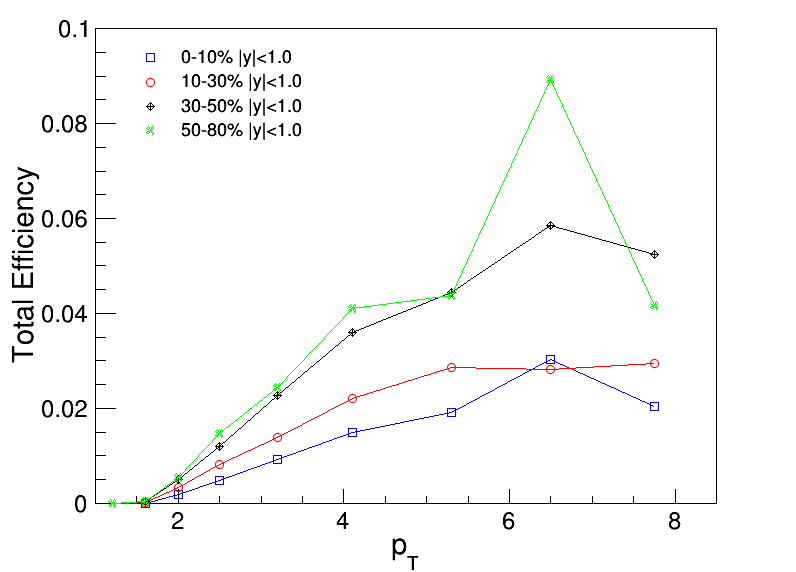
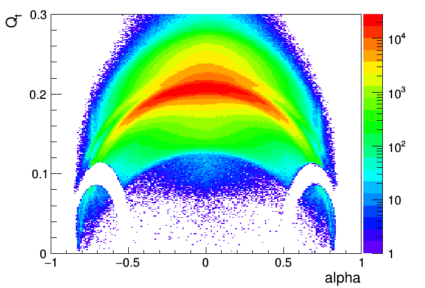

~~~c++
// pt                          0,   1,   2,   3,   4,   5,   6,   7,   8,   9,  10,  11,  12
    double pTbin[14] = {0.2, 0.4, 0.6, 0.8, 1.0, 1.4, 1.8, 2.2, 2.8, 3.6, 4.6, 6.0, 7.0, 8.5};
// cent                   0,  1,   2,   3,   4
    int centBin[6] = {0, 20, 60, 100, 160, 200};
~~~

## Samples

| | |
|---|---|
| Data (HIMB4 RERECO) | `/HIMinimumBias4/qwang-V0Skim_v3-9d53152409b8a9b6fb15042030d9bf69/USER` |
| MC (Semi-private RECODEBUG)  | `/MinBias_Hydjet_Drum5F_2018_5p02TeV/qwang-crab_HydjetDrum5F_RECODEBUG_V0Skim_v2-4fb2a1ba2f6b043399c08fb9db565e25/USER` |
| Data (HIMB19 RERECO WrongSign) | `/HIMinimumBias19/qwang-V0Skim_v3-5f932986cf38f9e8dbd6c3aea7f6c2b4/USER` |

## BDT

### Training strategy

* Signal is from MC.
* Backgound is from either Data (WrongSign or SideBand) or MC.
    * WrongSign, two daughters with the same charge sign.
    * SideBand, for $K_s$ with (mass<0.489 || mass>0.506), for $\Lambda$ with (mass<1.1095 || mass>1.122).
* 250 DTs, Depth = 3, AdaptiveBoost. `H:!V:NTrees=250:MinNodeSize=2.5%:MaxDepth=3:BoostType=AdaBoost:AdaBoostBeta=0.5:UseBaggedBoost:BaggedSampleFraction=0.5:SeparationType=GiniIndex:nCuts=20`

### Variables

|Train Variable| description |
|---|---|
|pt       |  $p_T$ |
|rapidity |  $y$   |
|vtxChi2  | vertex Chi2 |
|cosThetaXYZ | Cosine 3D pointing angle $\theta$ |
| Lxyz | 3D decay length |
| vtxDecaySigXYZ | 3D vertex significance |
| DCA | Distance of the closest approach |
| pTrkNHit | NHit of the positive daughter track |
| pTrkPt | $p_T$ of the positive daughter track |
| pTrkPtError | $p_T$ error of the positive daughter track |
| pTrkEta | $\eta$ of the positive daughter track |
| pTrkNPxLayer | NPixel layer with hits of the positive daughter track |
| pTrkDCASigXY | transverse DCA significance of the positive daughter track |
| pTrkDCASigZ  | longitudinal DCA significance of the positive daughter track |
| nTrkNHit | NHit of the negative daughter track |
| nTrkPt | $p_T$ of the negative daughter track |
| nTrkPtError | $p_T$ error of the negative daughter track |
| nTrkEta | $\eta$ of the negative daughter track |
| nTrkNPxLayer | NPixel layer with hits of the negative daughter track |
| nTrkDCASigXY | transverse DCA significance of the negative daughter track |
| nTrkDCASigZ  | longitudinal DCA significance of the negative daughter track |
| Cent | centrality bin |

|Spectator Variable| description |
|---|---|
|mass | V0 particle mass |
|eta  | V0 particle $\eta$ |
|phi  | V0 particle $\phi$ |
|pdgId| V0 particle pdgId |

### Training sets

| Name | Description |
|---|---|
| MCFull | MC signal + MC background, full eta range.  |
| MCrap1 | MC signal + MC background, limit V0 rapidity $\|y\|<1.$.  |
| DataWSrap1 | MC signal + data wrong sign background, limit V0 rapidity $\|y\|<1.$. |
| DataSBrap1 | MC signal + data side-band background, limit V0 rapidity $\|y\|<1.$. |

## $\Lambda$ BDT Performance

### Centrality 0-10%

|                    |          MCFull     |      MCrap1        |      DataWSrap1     |     DataSBrap1      |
|:-------------------|:--------------------|:-------------------|:--------------------|:--------------------|
| $1.0 < p_T < 1.4$  | NA                  | NA                 | NA                  | NA                  |
| $1.4 < p_T < 1.8$  | almost NA           | almost NA          | almost NA 110/1,500 | almost NA 105/1,500 |
| $1.8 < p_T < 2.2$  | 120(NA)/30,000      | 108(NA)/40,000     | 115(13.58)/40,000   | 108(14.14)/40,000   |
| $2.2 < p_T < 2.8$  | 110(17.38)/100,000  | 103(20.51)/100,000 | 109(19.64)/100,000  | 103(19.84)/100,000  |
| $2.8 < p_T < 3.6$  | 104(17.18)/100,000  | 104(18.68)/100,000 | 104(18.44)/100,000  | 103(18.37)/100,000  |
| $3.6 < p_T < 4.6$  | 108(11.11)/40,000   | 103(11.93)/40,000  | 106(11.65)/40,000   | 101(11.76)/40,000   |
| $4.6 < p_T < 6.0$  | 109(5.42)/10,000    | 102(5.82)/10,000   | 108(5.66)/10,000    | 101(5.72)/10,000    |
| $6.0 < p_T < 7.0$  | 110(1.86)/1,500     | 104(2.01)/1,400    | 111(1.88)/1,500     | 104(1.95)/1,300     |
| $7.0 < p_T < 8.5$  | 110(1.37\*)/600     | 103(1.23)/550      | 110(\*)/600         | 103(1.23\*)/600     |

### Centrality 10-30%

|                    |          MCFull     |      MCrap1        |      DataWSrap1     |     DataSBrap1      |
|:-------------------|:--------------------|:-------------------|:--------------------|:--------------------|
| $1.0 < p_T < 1.4$  | NA                  | NA                 | NA                  | NA                  |
| $1.4 < p_T < 1.8$  | almost NA           | 100(NA)/5,000      | almost NA 110/4,200 | almost NA 100/5,000 |
| $1.8 < p_T < 2.2$  | 120(NA)/70,000      | 110(17.8\*)/70,000 | 110(\*)/90,000      | 107()/80,000        |
| $2.2 < p_T < 2.8$  | 111(23.04)/180,000  | 107(25.21)/180,000 | 110(24.85)/170,000  | 109(24.95)/160,000  |
| $2.8 < p_T < 3.6$  | 109(21.18)/150,000  | 105(22.32)/140,000 | 108(22.21)/140,000  | 105(22.19)/150,000  |
| $3.6 < p_T < 4.6$  | 112(14.23)/65,000   | 105(14.82)/65,000  | 108(14.70)/65,000   | 105(14.73)/65,000   |
| $4.6 < p_T < 6.0$  | 114(7.41)/20,000    | 104(7.69)/20,000   | 110(7.64)/19,000    | 103(7.68)/20,000    |
| $6.0 < p_T < 7.0$  | 119(2.72)/2,600     | 108(2.83)/2,600    | 114(2.79)/2,800     | 104(2.81)/2,800     |
| $7.0 < p_T < 8.5$  | 115(1.86)/1,300     | 109(1.82)/1,200    | 110(\*)/1,300       | 109(1.82)/1,200     |

### Centrality 30-50%

|                    |          MCFull     |      MCrap1        |      DataWSrap1     |     DataSBrap1      |
|:-------------------|:--------------------|:-------------------|:--------------------|:--------------------|
| $1.0 < p_T < 1.4$  | NA                  | NA                 | NA                  | NA                  |
| $1.4 < p_T < 1.8$  | NA 120()/3,000      | 110()/1,800        | 117()/2,000         | 108()/2,000         |
| $1.8 < p_T < 2.2$  | 120(12.24)/38,000   | 115(12.14)/34,000  | 110()/40,000        | 110()/40,000        |
| $2.2 < p_T < 2.8$  | 115(16.79)/80,000   | 109(17.44)/80,000  | 111(17.33)/80,000   | 111(17.37)/80,000   |
| $2.8 < p_T < 3.6$  | 114(16.29)/80,000   | 108(16.63)/80,000  | 108(16.60)/80,000   | 108(16.58)/80,000   |
| $3.6 < p_T < 4.6$  | 115(11.29)/40,000   | 107(11.46)/40,000  | 109(11.44)/40,000   | 107(11.44)/40,000   |
| $4.6 < p_T < 6.0$  | 116(6.32)/14,000    | 107(6.40)/14,000   | 109(6.39)/14,000    | 106(6.40)/14,000    |
| $6.0 < p_T < 7.0$  | 116(2.54)/2,400     | 107(2.57)/2,400    | 114(2.56)/2,400     | 106(2.57)/2,400     |
| $7.0 < p_T < 8.5$  | 122(1.69)/1,100     | 114(1.71)/1,100    | 117(1.71)/1,100     | 111(1.72)/1,200     |

### Centrality 50-80%

|                    |          MCFull     |      MCrap1        |      DataWSrap1     |     DataSBrap1      |
|:-------------------|:--------------------|:-------------------|:--------------------|:--------------------|
| $1.0 < p_T < 1.4$  | NA                  | NA                 | NA                  | NA                  |
| $1.4 < p_T < 1.8$  | NA 120()/900        | 100(2.09)/900      | 110(1.99)/700       | 100()/900           |
| $1.8 < p_T < 2.2$  | 115()/11,000        | 107(6.85)/11,000   | 110(6.80)/11,000    | 108(6.82)/11,000    |
| $2.2 < p_T < 2.8$  | 106(9.50)/24,000    | 98(9.60)/24,000    | 102(9.60)/24,000    | 101(9.58)/24,000    |
| $2.8 < p_T < 3.6$  | 107(9.03)/24,000    | 97(9.09)/24,000    | 100(9.09)/24,000    | 98(9.08)/24,000     |
| $3.6 < p_T < 4.6$  | 107(6.44)/13,000    | 97(6.48)/13,000    | 99(6.48)/13,000     | 99(6.48)/13,000     |
| $4.6 < p_T < 6.0$  | 113(3.89)/5,000     | 99(3.90)/5,000     | 102(3.91)/5,000     | 102(3.91)/5,000     |
| $6.0 < p_T < 7.0$  | 110(1.65)/1,000     | 104(1.65)/1,000    | 109(1.65)/1,000     | 101(1.65)/1,000     |
| $7.0 < p_T < 8.5$  | 116(1.14)/500       | 110(1.14)/500      | 110(1.14)/500       | 109(1.16)/500       |

### Optimization

The $\Lambda$ selection is suggested to use MCFull at 110(BDT cut = 0.10).

## $K_{s}^0$ BDT Performance

### Centrality 0-10%

|                    |          MCFull     |
|:-------------------|:--------------------|
| $0.2 < p_T < 0.4$  | NA                  |
| $0.4 < p_T < 0.6$  | NA                  |
| $0.6 < p_T < 0.8$  | 115(1.62)/170       |
| $0.8 < p_T < 1.0$  | 106(5.37)/5,000     |
| $1.0 < p_T < 1.4$  | 103(25.01)/90,000   |
| $1.4 < p_T < 1.8$  | 102(37.46)/200,000  |
| $1.8 < p_T < 2.2$  | 105(38.67)/200,000  |
| $2.2 < p_T < 2.8$  | 105(35.61)/170,000  |
| $2.8 < p_T < 3.6$  | 104(23.62)/80,000   |
| $3.6 < p_T < 4.6$  | 105(12.72)/22,000   |
| $4.6 < p_T < 6.0$  | 112(6.51)/6,000     |
| $6.0 < p_T < 7.0$  | 116(2.82)/1,200     |
| $7.0 < p_T < 8.5$  | 118(2.12)/700       |

### Centrality 10-30% 

|                    |          MCFull     |
|:-------------------|:--------------------|
| $0.2 < p_T < 0.4$  | NA                  |
| $0.4 < p_T < 0.6$  | NA                  |
| $0.6 < p_T < 0.8$  | 117(1.64)/300       |
| $0.8 < p_T < 1.0$  | 112(8.26)/9,000     |
| $1.0 < p_T < 1.4$  | 106(33.84)/160,000  |
| $1.4 < p_T < 1.8$  | 108(47.87)/300,000  |
| $1.8 < p_T < 2.2$  | 109(49.30)/320,000  |
| $2.2 < p_T < 2.8$  | 110(45.71)/290,000  |
| $2.8 < p_T < 3.6$  | 108(31.00)/140,000  |
| $3.6 < p_T < 4.6$  | 109(17.49)/44,000   |
| $4.6 < p_T < 6.0$  | 112(9.73)/13,000    |
| $6.0 < p_T < 7.0$  | 114(4.41)/3,000     |
| $7.0 < p_T < 8.5$  | 116(3.32)/1,700     |

### Centrality 30-50% 

|                    |          MCFull     |
|:-------------------|:--------------------|
| $0.2 < p_T < 0.4$  | NA                  |
| $0.4 < p_T < 0.6$  | NA                  |
| $0.6 < p_T < 0.8$  | 115(1.27)/200       |
| $0.8 < p_T < 1.0$  | 118(6.35)/5,000     |
| $1.0 < p_T < 1.4$  | 113(25.57)/90,000   |
| $1.4 < p_T < 1.8$  | 117(37.71)/190,000  |
| $1.8 < p_T < 2.2$  | 115(37.55)/200,000  |
| $2.2 < p_T < 2.8$  | 114(34.87)/170,000  |
| $2.8 < p_T < 3.6$  | 113(24.98)/90,000   |
| $3.6 < p_T < 4.6$  | 110(15.55)/34,000   |
| $4.6 < p_T < 6.0$  | 105(10.12)/15,000   |
| $6.0 < p_T < 7.0$  | 100(5.03)/3,600     |
| $7.0 < p_T < 8.5$  | 99(3.95)/2,200      |

### Centrality 50-80% 

|                    |          MCFull     |
|:-------------------|:--------------------|
| $0.2 < p_T < 0.4$  | NA                  |
| $0.4 < p_T < 0.6$  | NA                  |
| $0.6 < p_T < 0.8$  | 110(\*)/80          |
| $0.8 < p_T < 1.0$  | 115(3.93)/2,000     |
| $1.0 < p_T < 1.4$  | 113(15.46)/30,000   |
| $1.4 < p_T < 1.8$  | 112(22.48)/50,000   |
| $1.8 < p_T < 2.2$  | 112(22.14)/65,000   |
| $2.2 < p_T < 2.8$  | 110(20.82)/60,000   |
| $2.8 < p_T < 3.6$  | 107(15.56)/34,000   |
| $3.6 < p_T < 4.6$  | 111(10.27)/15,000   |
| $4.6 < p_T < 6.0$  | 95(7.18)/7,000      |
| $6.0 < p_T < 7.0$  | 94(3.64)/1,700      |
| $7.0 < p_T < 8.5$  | 87(2.85)/1,000      |

### Optimization

The $K_{S}^0$ selection is suggested to use MCFull at 110 (BDT cut = 0.10).

## $\Lambda$ Efficiencies and fake rates

### $\Lambda$ acceptance

### $\Lambda$ RECO efficiency

### $\Lambda$ total efficiency

### $\Lambda$ fake rate

### $\Lambda$ 2D total efficiency

* 0-10%

* 10-30%

* 30-50%

* 50-80%

## $K_{S}^0$ Efficiencies and fake rates

### $K_{S}^0$ acceptance

### $K_{S}^0$ RECO efficiency

### $K_{S}^0$ total efficiency

### $K_{S}^0$ fake rate

### $K_{S}^0$ 2D total efficiency

* 0-10%

* 10-30%

* 30-50%

* 50-80%

## Armenteros-Podolanski Plot

### $\Lambda$ $1.8 < p_{T} < 8.5$ $|y|<1.0$ 0-80%,

### $K_{S}^0$ $0.6 < p_{T} < 8.5$ $|y|<1.0$ 0-80%, 

## Summary

* The weight xml file for $\Lambda$ is located [here](BDT/MC_Full_BDT250_D3.LM.weights.xml).
* The weight xml file for $K_{S}^0$ is located [here](BDT/MC_Full_BDT250_D3.KS.weights.xml).
