# 2018 PbPb 5.02 TeV V0 MVA Performance

## Data Sample

MinBias PD: `/HIMinimumBias4/HIRun2018A-04Apr2019-v1/AOD`

Skim: `/HIMinimumBias4/qwang-V0Skim_v3-9d53152409b8a9b6fb15042030d9bf69/USER`

## Fitting

* Signal (solid red curve): double gaussian with common mean (dashed red and blue curves, solid red).
* Background(solid blue curve): 4th order polynomial.
* Sum of signal and background (solid black curve).
* Data (black histogram).

## $K_{S}^0$

* [MVA xml](BDT/MC_Full_BDT250_D4.KS.weights.xml)
* Mid rapidity: $|y|<1.0$
* Suggested $p_T$ range: $1.0 < p_T < 8.5$

### 0-10% Centrality

### 10-30% Centrality

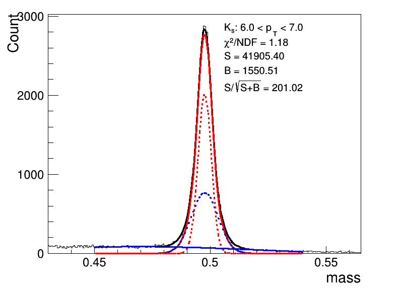

### 30-50% Centrality

### 50-80% Centrality

### 80-100% Centrality

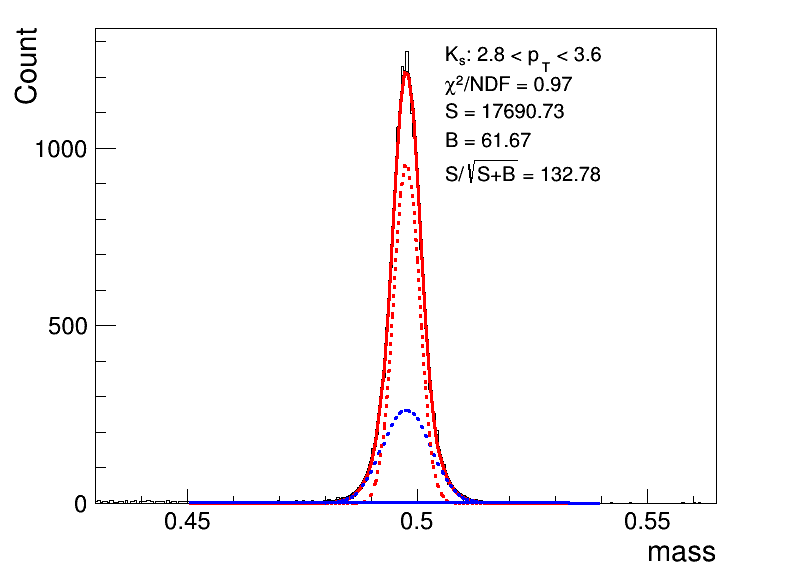

## $\Lambda$

* [MVA xml](BDT/MC_Full_BDT250_D4.LM.weights.xml)
* Mid rapidity: $|y|<1.0$
* Suggested $p_T$ range: $1.8 < p_T < 8.5$. (For reference, $1.0 < p_T < 1.8$ plots are also shown.)

### 0-10% Centrality

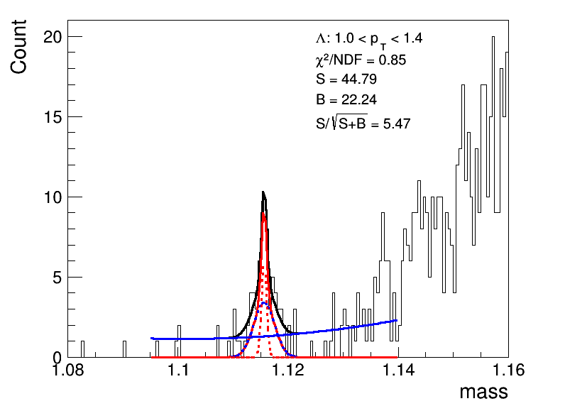

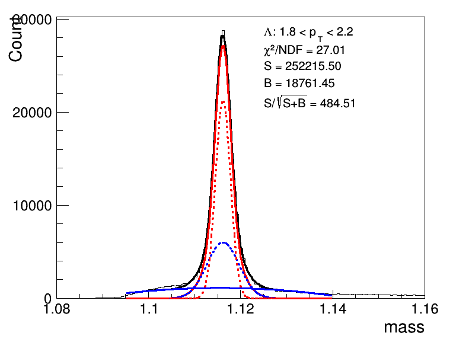

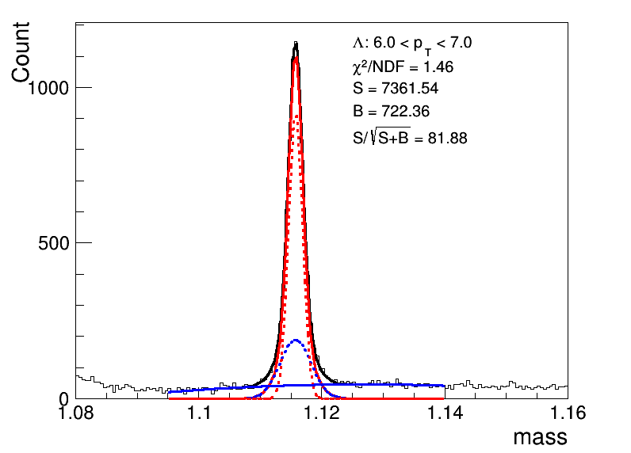
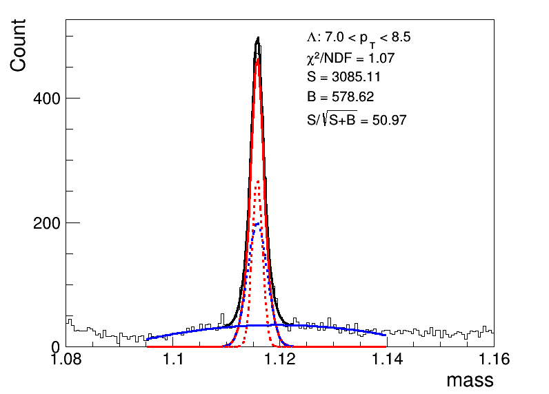

### 10-30% Centrality

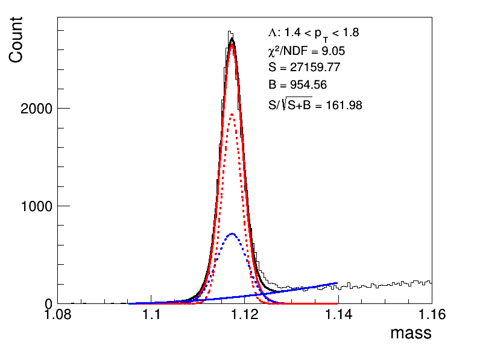
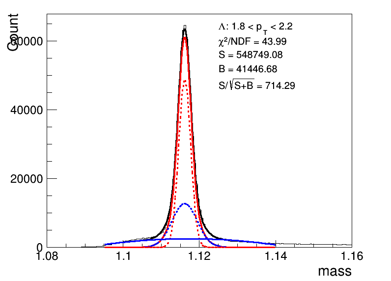
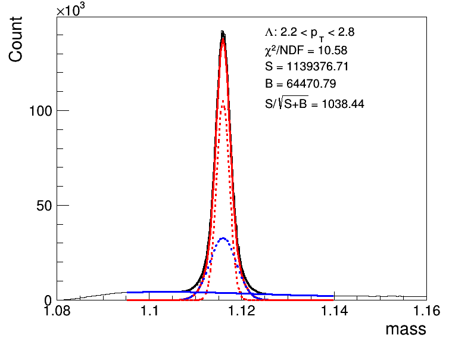

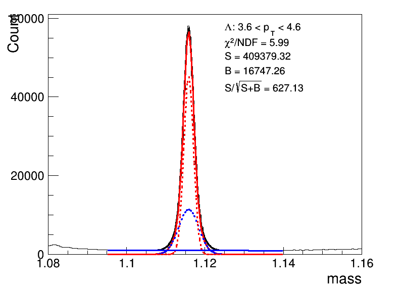

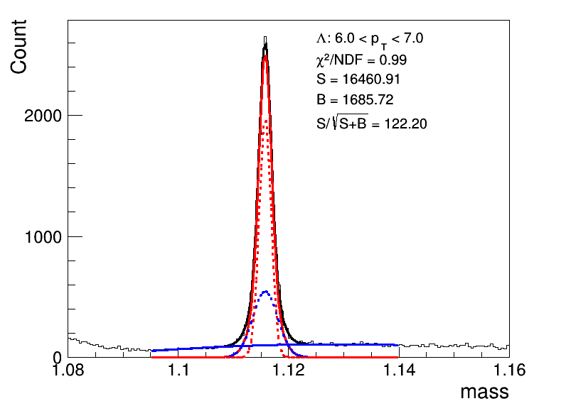

### 30-50% Centrality

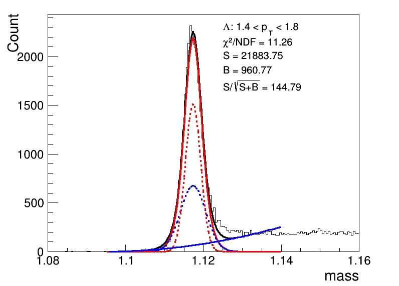

### 50-80% Centrality

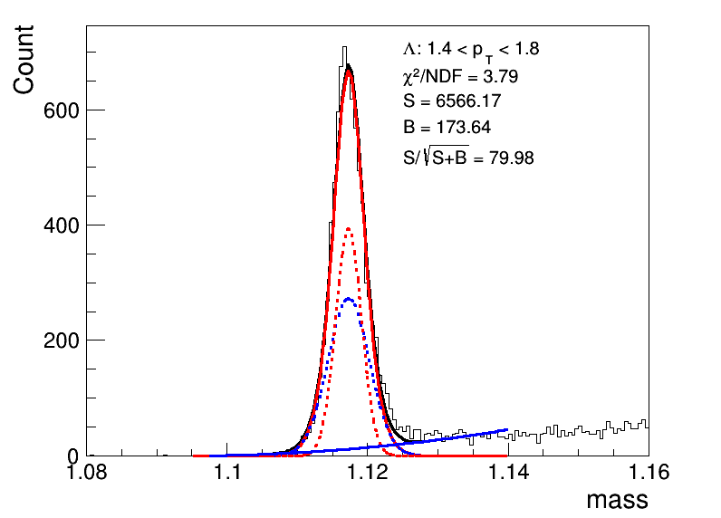

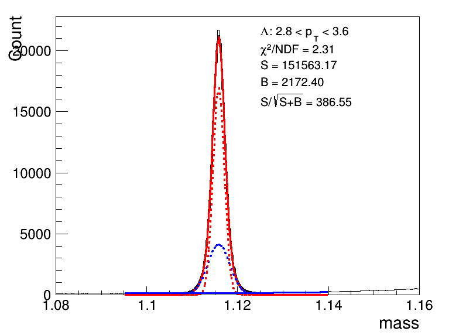

### 80-100% Centrality

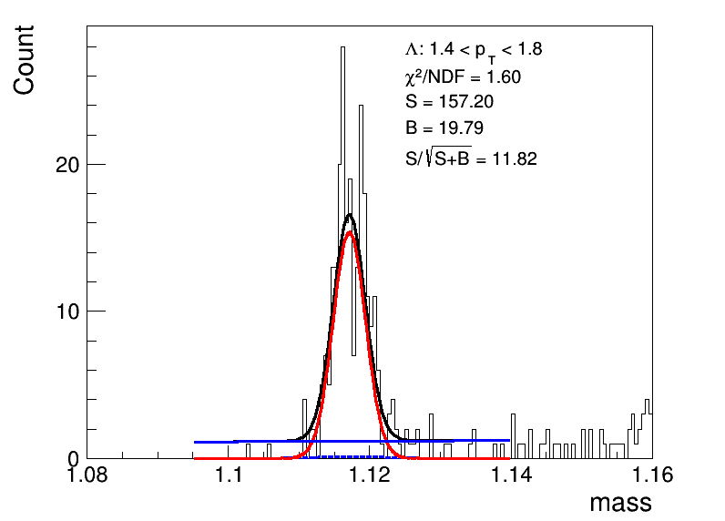
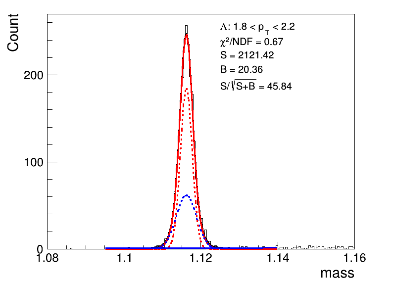
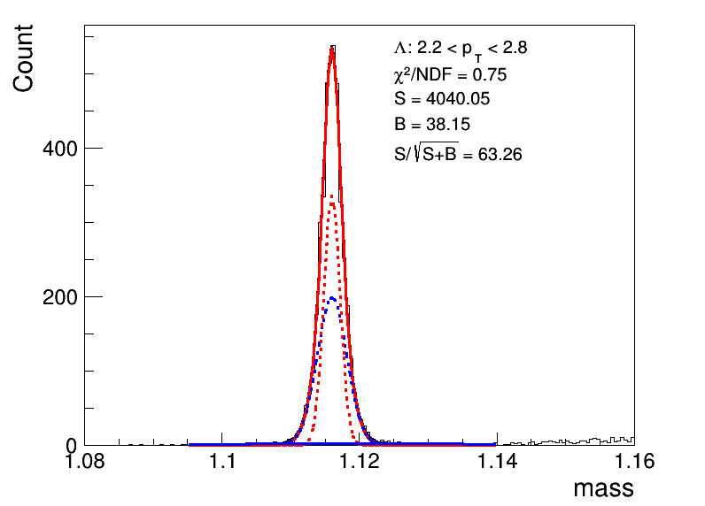

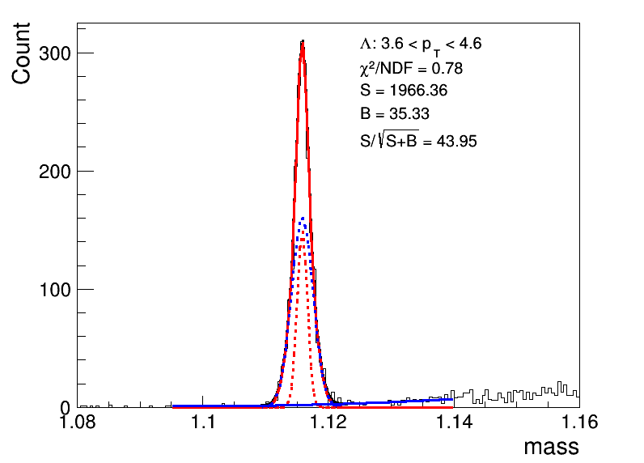

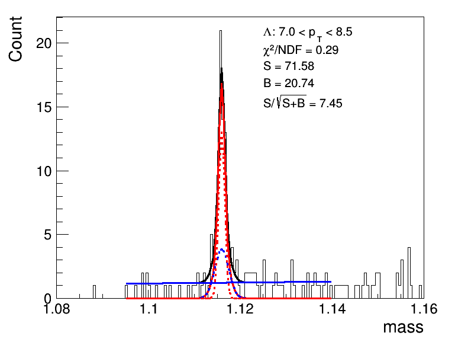

## MVA Training with individual centrality bin (systematics)

### $K_{S}^0$

* [MVA xml 0-5%](BDTCent/TMVAClassification_BDT250_D4.KS_0.weights.xml)
* [MVA xml 5-10%](BDTCent/TMVAClassification_BDT250_D4.KS_1.weights.xml)
* [MVA xml 10-30%](BDTCent/TMVAClassification_BDT250_D4.KS_2.weights.xml)
* [MVA xml 30-50%](BDTCent/TMVAClassification_BDT250_D4.KS_3.weights.xml)
* [MVA xml 50-80%](BDTCent/TMVAClassification_BDT250_D4.KS_4.weights.xml)

### $\Lambda$

* [MVA xml 0-5%](BDTCent/TMVAClassification_BDT250_D4.LM_0.weights.xml)
* [MVA xml 5-10%](BDTCent/TMVAClassification_BDT250_D4.LM_1.weights.xml)
* [MVA xml 10-30%](BDTCent/TMVAClassification_BDT250_D4.LM_2.weights.xml)
* [MVA xml 30-50%](BDTCent/TMVAClassification_BDT250_D4.LM_3.weights.xml)
* [MVA xml 50-80%](BDTCent/TMVAClassification_BDT250_D4.LM_4.weights.xml)

